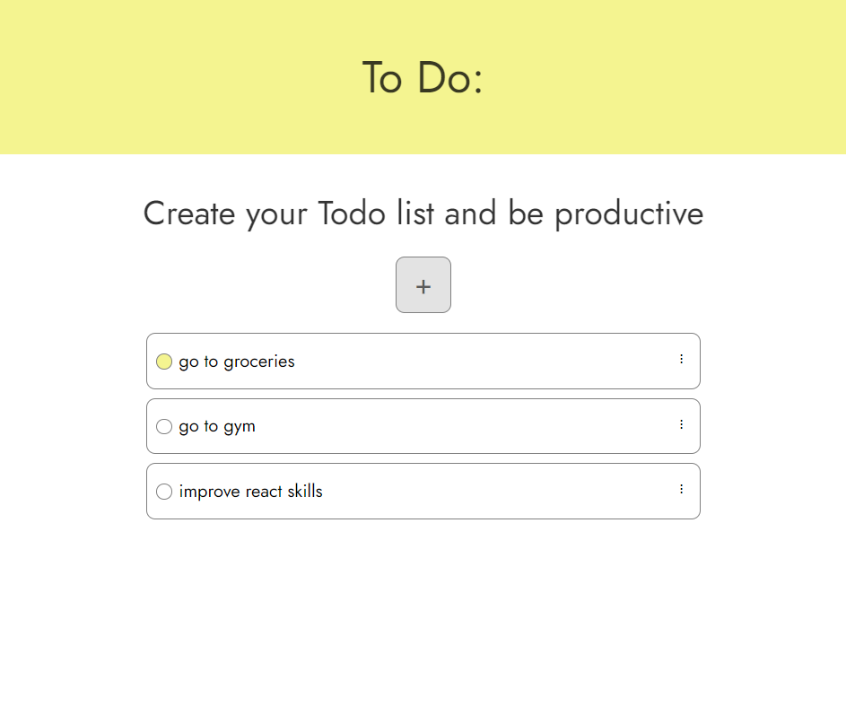

# Todo list

This is Todo list with responsive design. You can add todos, edit, remove and mark them and they will be saved in localstorage.

## Technologies Used

- React, Typescript, CSS

## Installation

You don't need to run app for use, but if you still want, follow these steps:

1. Clone this repository.
2. Install dependencies by runnin npm install.
3. Start application using npm run dev.

## Contributing

I welcome contributions from the community to improve the website's functionality, user experience, and overall performance. If you'd like to contribute, please follow these steps:

1. Fork the repository.
2. Create your feature branch (git checkout -b feature/YourFeature).
3. Commit your changes (git commit -am 'Add some feature').
4. Push to the branch (git push origin feature/YourFeature).
5. Create a new Pull Request.

## Contact

If you have any questions, suggestions, or concerns, please don't hesitate to contact me at nana.grdzelishvili7@gmail.com. I appreciate your feedback!
